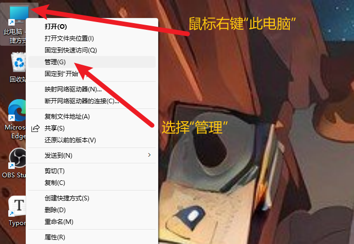
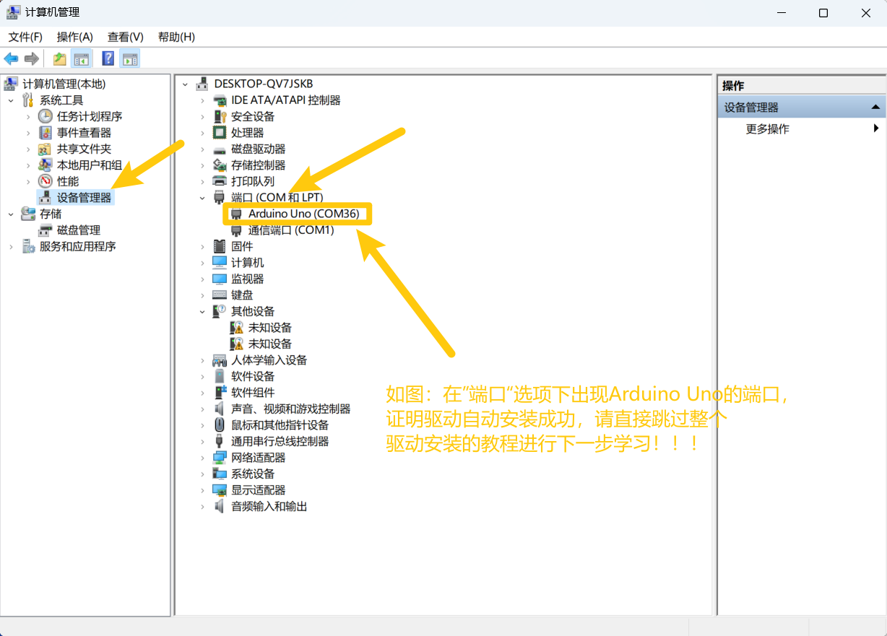
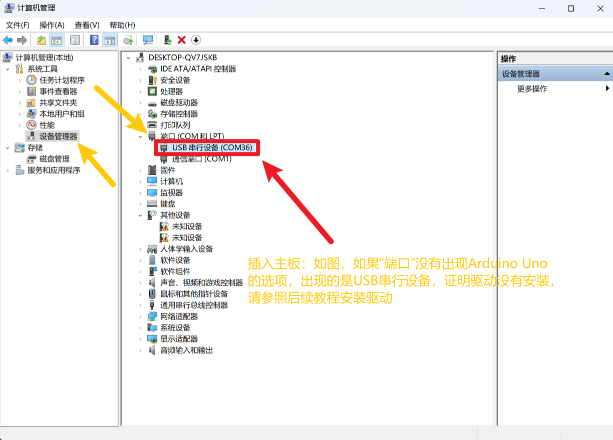
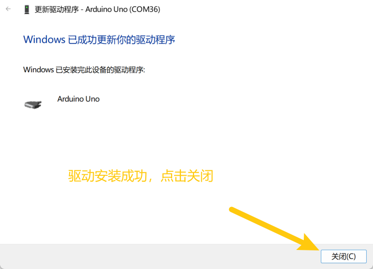

# 2. 驱动安装

## 2.1 驱动下载

驱动下载：[USB驱动下载](./USB驱动文件.7z)

## 2.2 驱动安装

1、将主板连接到电脑

2、打开 “**设备管理器**”.

3、检查驱动是否已经安装

情况一：驱动安装完成，请跳过驱动教程，进行下一步学习

情况二：驱动没有安装，请进行以下教程手动安装驱动

（1）、鼠标右击 “**USB串行设备**”，在弹出框中选择
“**更新驱动程序（P）**”

（2）、点击选择 “**浏览我的电脑以查找驱动程序（R）**”.

（3）、点击
“**浏览（R）**”选项，在弹出的方框中找到Arduino安装路径下的，或者直接选择提供的,点击
“**确定**”，完成后点击 “**下一步**” 进行驱动安装.

（4）、界面显示如下图类似的话语，证明驱动安装成功，点击 “**关闭**”.

（5）、驱动安装完成后，选择 “**端口**”
选项，如图对应端口的名字改变成Arduino Uno，证明驱动安装完成.

